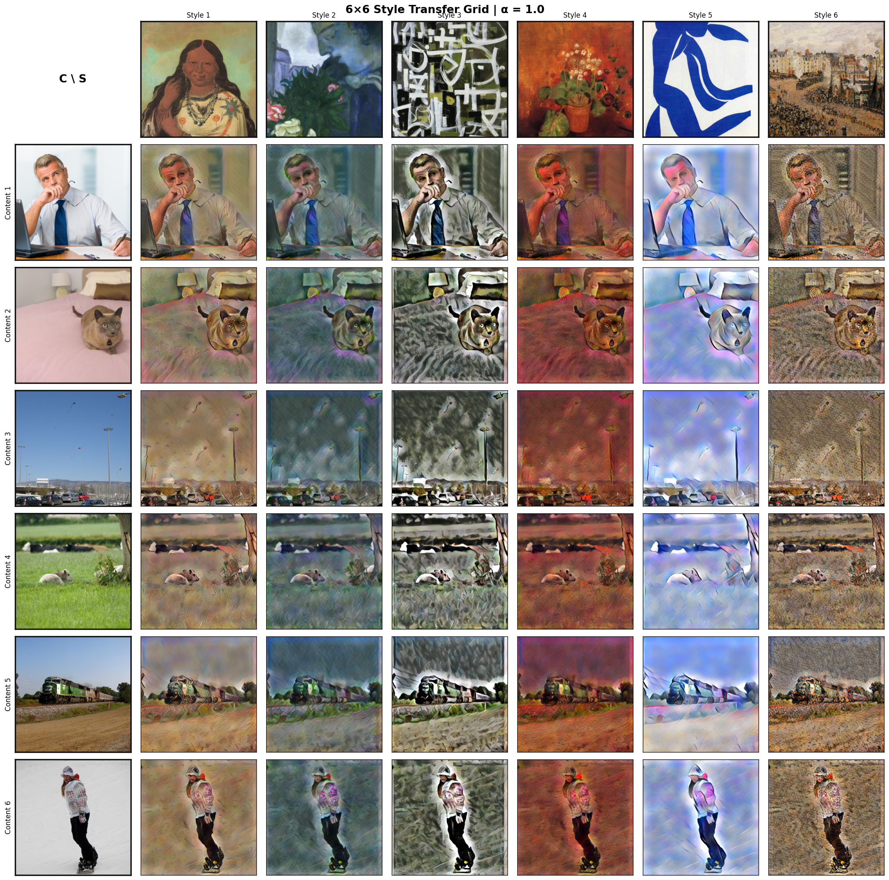
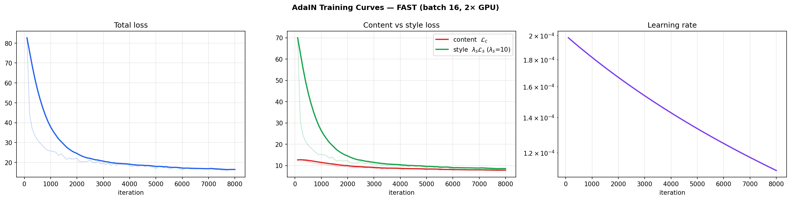
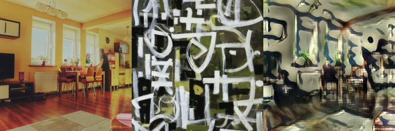
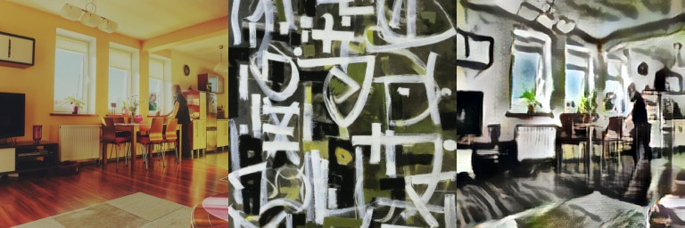
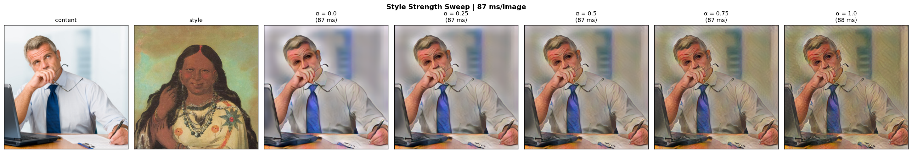
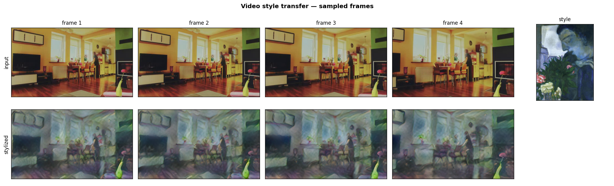

# AdaIN — Real-Time Arbitrary Style Transfer

A PyTorch reimplementation of **Adaptive Instance Normalization** (Huang & Belongie, ICCV 2017):
render any content image in the style of any painting, in a single forward pass, including
paintings the model never saw during training.

The decoder is trained from scratch on **MS-COCO 2017** (content) and **WikiArt** (style) on
Kaggle. A full run takes **under one hour on a single Tesla T4**, and a 512×512 image is
stylized in **40 ms** (fp16).


*Rows: COCO `val2017` photos. Columns: WikiArt paintings held out from training. One decoder produces all 36 images.*

---

## Contents

- [How AdaIN works](#how-adain-works)
- [Architecture](#architecture)
- [Training setup](#training-setup)
- [Results](#results)
- [Notebook walkthrough](#notebook-walkthrough)
- [Repository structure](#repository-structure)
- [Run it on Kaggle](#run-it-on-kaggle)
- [Use the trained weights](#use-the-trained-weights)
- [Limitations and next steps](#limitations-and-next-steps)
- [About the project](#about-the-project)
- [References](#references)

---

## How AdaIN works

Classic neural style transfer (Gatys et al.) optimizes every output image for hundreds of
iterations. Fast feed-forward methods (Johnson et al.) are real-time but need one network per
style. AdaIN gets both: **one feed-forward network for every style**.

The idea is that the *style* of an image is largely captured by the channel-wise mean and
standard deviation of its deep features. For content features $x$ and style features $y$,
AdaIN replaces the statistics of the content with those of the style:

$$\text{AdaIN}(x, y) = \sigma(y)\left(\frac{x - \mu(x)}{\sigma(x)}\right) + \mu(y)$$

The layer has no learnable parameters, so a new style only means new statistics, never new
training. At inference, the strength of the style is controlled by blending with the original
content features:

$$t_\alpha = \alpha\,\text{AdaIN}(x, y) + (1-\alpha)\,x$$

## Architecture

```
content image ──► VGG-19 encoder (frozen) ──► f(c) ─┐
                                                    ├──► AdaIN ──► t ──► decoder (trained) ──► stylized image
style image ────► VGG-19 encoder (frozen) ──► f(s) ─┘
```

| Component | Details | Parameters |
|---|---|---|
| **Encoder** | VGG-19 pretrained on ImageNet, truncated at `relu4_1`, frozen. Returns `relu1_1`, `relu2_1`, `relu3_1`, `relu4_1`; ImageNet normalization is built in | 3.5 M (frozen) |
| **AdaIN** | Channel-wise statistics transfer | 0 |
| **Decoder** | Mirror of the encoder, nearest-neighbor upsampling instead of pooling, reflection padding | 3.5 M (trained) |

### Loss

Both terms are computed in VGG feature space ($g$ = decoder, $f$ = encoder, $\phi_i$ = encoder
layer $i$, $t$ = AdaIN output, $s$ = style image):

$$\mathcal{L}_c = \lVert f(g(t)) - t \rVert_2^2$$

$$\mathcal{L}_s = \sum_{i=1}^{4} \lVert \mu(\phi_i(g(t))) - \mu(\phi_i(s)) \rVert_2 + \lVert \sigma(\phi_i(g(t))) - \sigma(\phi_i(s)) \rVert_2$$

$$\mathcal{L} = \mathcal{L}_c + \lambda_s \mathcal{L}_s, \qquad \lambda_s = 10$$

The content target is the AdaIN output $t$, not the content image's features, so the decoder
learns to faithfully decode *re-styled* features.

## Training setup

Training uses a fixed random subset of each dataset and fp16 mixed precision, which brings a
full run down to about an hour on one GPU.

| Setting | Value |
|---|---|
| Content data | 20,000 images drawn from MS-COCO 2017 `train2017` (≈118k) |
| Style data | 10,000 paintings drawn from WikiArt (≈81k), plus 100 paintings held out for evaluation |
| Pre-processing | Shorter side resized to 512 px, random 256×256 crop |
| Optimizer | Adam, decoder only |
| Learning rate | $\text{lr}_t = \text{lr}_0 / (1 + \text{decay}\cdot t)$, from 2e-4 to 1.1e-4 |
| Batch size | 16 |
| Precision | fp16 autocast + gradient scaling |
| Hardware | 1× NVIDIA Tesla T4 (Kaggle) |

Two presets are available in the notebook:

| Config | Iterations | Time on a T4 | Use |
|---|---|---|---|
| `DEMO` | 3,000 | ~15–25 min | Quick check, recognizable but rough stylization |
| **`FAST`** | **8,000** | **~55 min** | **Default; all results below come from this run** |

### Engineering details

- **Exact resumption.** Instead of `shuffle=True`, a flat sequence of
  `iterations × batch_size` indices is pre-generated with a fixed seed. Resuming at iteration
  *k* is a slice of that sequence, so a new session picks up at exactly the right sample.
- **Persistent checkpoints.** Decoder, optimizer, AMP scaler and the full loss history are
  saved atomically every 1,000 iterations and uploaded to a private Hugging Face model repo; a
  new Kaggle session restores the newest one automatically.
- **Fast data loading.** JPEGs are decoded with PIL's `draft` mode, which downsamples large
  WikiArt paintings during decoding. File lists are cached between runs.
- **Robustness.** Pre-flight checks before training (one GPU step, then the first data
  batch), periodic RAM/GPU memory logs, `faulthandler` stack dumps, and a clean stop with a
  checkpoint before Kaggle's 12-hour limit.

## Results

### Training

8,000 iterations in **0.91 h** (0.41 s/iteration). Memory stayed flat throughout
(≈7 GB host RAM, 9.6 GB peak GPU memory).



| Loss | Start | End |
|---|---|---|
| Total | 49.28 | **16.37** |
| Content $\mathcal{L}_c$ | 12.58 | **7.85** |
| Style $\mathcal{L}_s$ | 3.67 | **0.85** |

*(Averages over the first and last 5% of the logged history.)*

The style loss falls fastest (×4.3): matching feature statistics is the easier part of the
task. The content loss decreases more slowly, since the decoder must learn to rebuild a sharp
image from re-normalized features. Both curves are still going down at 8,000 iterations, so a
longer run would keep improving.

**Progress during training** (content | style | output, saved at each checkpoint):

| Iteration 1,000 | Iteration 8,000 |
|---|---|
|  |  |

### Qualitative results

The grid at the top of this page uses only images the model never trained on. Observations:

- Each column takes on its painting's palette and texture while each photo stays recognizable.
- High-contrast, textured styles transfer most visibly.
- AdaIN transfers feature **statistics**, not shapes: a Matisse-like cut-out passes on its
  blue-and-white palette but not its large flat forms.
- Large uniform regions (sky, bedspread, snow) receive the most texture; fine details such as
  faces are softened.

### Style strength (α)



The style is blended in smoothly as α goes from 0 to 1. At α = 0 the output is the decoder's
reconstruction of the content, which keeps the structure but is softer than the input.

### Inference speed

Single image on one Tesla T4, full pipeline (encode content and style, AdaIN, decode):

| Resolution | Precision | ms / image | Images / s |
|---|---|---|---|
| 512×512 | fp32 | 86.0 ± 0.6 | 11.6 |
| 512×512 | fp16 | **40.4 ± 0.3** | 24.8 |
| 256×256 | fp32 | 22.0 ± 0.3 | 45.4 |
| 256×256 | fp16 | **10.7 ± 0.2** | **93.3** |

fp16 halves latency at both resolutions, and 256×256 is about 4× faster than 512×512, in line
with the 4× fewer pixels.

### Video

Each frame is stylized independently with a fixed style (style statistics computed once,
frames in batches of 8). With no input video attached, the notebook generates a 4-second
pan-and-zoom clip from a COCO image.



96 frames at 256 px: **11.5 FPS** model throughput and 10.7 FPS end-to-end in fp32, including
OpenCV video I/O. Clips: [`video/demo_input.mp4`](video/demo_input.mp4) →
[`video/demo_input_stylized_h264.mp4`](video/demo_input_stylized_h264.mp4).

## Notebook walkthrough

[`AdaIN_Style_Transfer.ipynb`](AdaIN_Style_Transfer.ipynb) is saved with its outputs. Every
code cell is preceded by a header and a description, and the result sections end with a short
interpretation.

| # | Section | What it does |
|---|---|---|
| 1 | Environment setup | CUDA memory settings (applied before PyTorch initializes), imports, seeds, output folders |
| 2 | Configuration | `DEMO` / `FAST` presets and all hyper-parameters |
| 3 | Datasets | Finds COCO and WikiArt under `/kaggle/input`, holds out 100 styles, draws the training subset |
| 4 | Data pipeline | Resize + random crop, fast JPEG decoding, reproducible index sequence |
| 5 | Model | VGG-19 encoder, AdaIN, decoder, losses, inference helpers, sanity checks |
| 6 | Checkpoints & resume | Local and Hugging Face Hub persistence, automatic resume |
| 7 | Training | Training loop with pre-flight checks, logging, previews and safe stopping |
| 8 | Training curves | Loss and learning-rate curves over the whole run |
| 9 | Qualitative results | 6×6 grid of unseen content × unseen styles |
| 10 | Style interpolation | α sweep with per-image timing |
| 11 | Inference benchmark | 512 and 256 px, fp32 and fp16 |
| 12 | Video style transfer | Frame-by-frame stylization with OpenCV |

## Repository structure

```
.
├── AdaIN_Style_Transfer.ipynb   # full notebook, with outputs
├── README.md
├── requirements.txt
├── weights/
│   ├── decoder_final.pth        # trained decoder (≈14 MB), all you need for inference
│   └── history.json             # run configuration and loss / learning-rate history
├── figures/
│   ├── style_grid_6x6.png       # 6×6 content × style grid
│   ├── alpha_sweep.png          # style strength sweep
│   ├── training_curves.png      # losses and learning rate
│   ├── video_frames.png         # sampled video frames, input vs stylized
│   └── inference_benchmark.csv  # latency table
├── previews/                    # content | style | output at every 1,000 iterations
└── video/
    ├── demo_input.mp4           # generated input clip
    └── demo_input_stylized_h264.mp4
```

## Run it on Kaggle

1. **Settings → Accelerator → GPU T4 x2** (one GPU is used for training).
2. **Settings → Internet → On**, to download the VGG-19 weights and use the Hugging Face Hub.
3. **Add Input**: an MS-COCO 2017 dataset with a `train2017/` folder (for example
   `awsaf49/coco-2017-dataset`) and a WikiArt dataset (for example `steubk/wikiart`). Both are
   detected automatically.
4. *(Recommended)* **Add-ons → Secrets**: add `HF_TOKEN`, a Hugging Face token with write
   access, so checkpoints survive between sessions.
5. Train with **Save Version → Save & Run All (Commit)**. A committed run keeps going in the
   background, whereas an interactive session stops when the browser tab is closed or idle.
6. To continue later, run again: training resumes from the newest checkpoint on the Hub, or
   from a previous version's output added as input.

Outputs are written to `/kaggle/working/`: checkpoints, `decoder_final.pth`, the loss history,
figures, previews and videos.

### Run locally

```bash
pip install -r requirements.txt
```

Set `CONTENT_DIR` and `STYLE_DIR` in section 3, and replace the `/kaggle/...` paths in
section 1 with local folders.

## Use the trained weights

After running sections 1 and 5 of the notebook (which define the encoder, the decoder and the
helpers), load the decoder and stylize your own images:

```python
decoder.load_state_dict(torch.load("weights/decoder_final.pth", map_location=DEVICE))
decoder.eval()

content = load_image("my_photo.jpg", size=512)
style = load_image("my_painting.jpg", size=512)
out = stylize(content, style, alpha=0.8)      # (3, H, W) tensor in [0, 1]
TF.to_pil_image(out).save("stylized.jpg")
```

## Limitations and next steps

- **Short training budget.** 8,000 iterations on a subset of the data: fine details are
  softened and the α = 0 reconstruction is slightly blurred. Training longer on the full
  datasets is the most direct improvement.
- **Statistics only.** AdaIN matches feature means and variances, so large-scale shapes and
  composition of a painting are not transferred.
- **No temporal consistency.** Video frames are stylized independently, so textures can
  flicker in high-motion clips. A temporal loss or optical-flow warping would address this.
- **Possible extensions:** color-preserving transfer, spatial control (different styles in
  different regions), and style mixing by interpolating several styles' statistics.

## Tech stack

Python, PyTorch, torchvision, Hugging Face Hub, OpenCV, Pillow, NumPy, pandas, Matplotlib, Kaggle.

## About the project

Group project for the **Deep Learning** module, 2SC IASD, École Supérieure en Informatique de
Sidi Bel Abbès (2025/2026), supervised by Prof. N. Dif.

Team: B. Abdel-ouakil, M. Safouane Mohammed, A. Ines, B. Mohammed Amdjed.

## Datasets

- [MS-COCO 2017](https://cocodataset.org/) for content images.
- [WikiArt](https://www.wikiart.org/) for style images.

Neither dataset is included in this repository.

## References

- X. Huang and S. Belongie, "Arbitrary Style Transfer in Real-time with Adaptive Instance
  Normalization", *ICCV*, 2017.
- L. A. Gatys, A. S. Ecker and M. Bethge, "Image Style Transfer Using Convolutional Neural
  Networks", *CVPR*, 2016.
- J. Johnson, A. Alahi and L. Fei-Fei, "Perceptual Losses for Real-Time Style Transfer and
  Super-Resolution", *ECCV*, 2016.
- K. Simonyan and A. Zisserman, "Very Deep Convolutional Networks for Large-Scale Image
  Recognition", *ICLR*, 2015.
